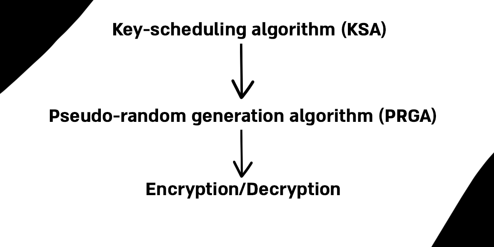
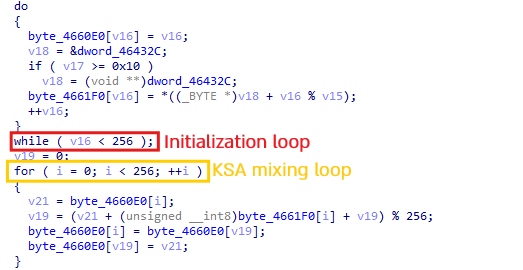
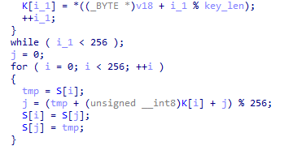
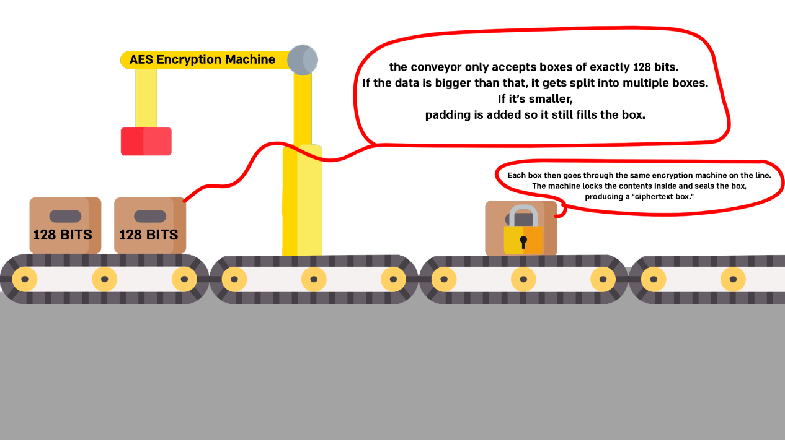
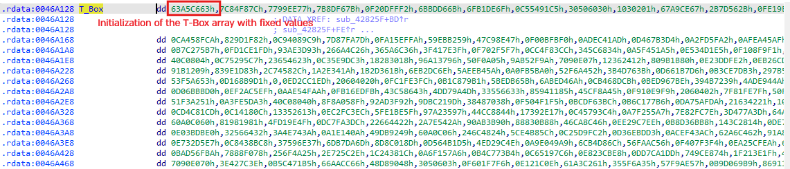
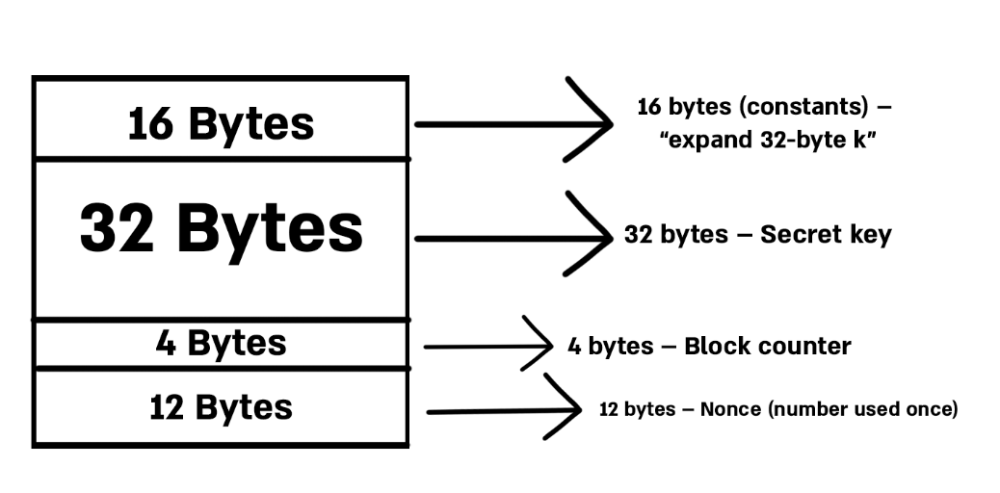
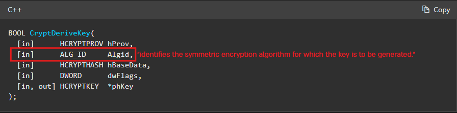

# Overview 
Encryption algorithms are everywhere in modern malware. Malware authors rely on them to hide sensitive parts of their operations, whether it’s encrypting configuration, shellcode, concealing command-and-control (C2) traffic, or simply obfuscating strings to hinder analysis. From simple stream ciphers like RC4 to more complex algorithms such as AES, ChaCha, or even custom versions of these algorithms, malware authors use encryption as both a shield and a weapon.

In this blog post, I’ll walk you through how to detect these encryption algorithms in malware. We’ll start with a high-level overview of each algorithm, and then I’ll demonstrate how you can manually identify them in practice using real-world malware samples that implement these algorithms.
# RC4
RC4 was created by Ron Rivest in 1987 and became one of the most widely used stream ciphers in software applications and protocols. The algorithm consists of three main parts, and we will go through each one to explain how they work.


### Key-scheduling algorithm (KSA)
The Key Scheduling Algorithm (KSA) works as follows: it first initializes an array of 256 elements with values ranging from 0 to 255. Then, in the second loop, each element is iteratively swapped based on both the key and the current state of the array. By the end of these two loops, the array is scrambled in a way that appears random, and this scrambled state is what RC4 uses to generate the keystream. We can think of this process like a deck of 256 cards: at first, the cards are in perfect order (from 0 to 255). Using the key as a guide, you shuffle the deck step by step until the cards are mixed in a way that looks random.
```c
// Initialize the state array S with values from 0 to 255
for i from 0 to 255 // 
    S[i] := i
endfor

// j is used as an index to determine swaps
j := 0

// Go through the array again, mixing it based on the key
for i from 0 to 255
	// Update j using the current value of S[i] and the key
    j := (j + S[i] + key[i mod keylength]) mod 256
    // Swap the current element with the element at position j
    swap values of S[i] and S[j]
endfor
```

### Pseudo-Random Generation Algorithm (PRGA)
The next step is the PRGA. Here, the index **i** continuously moves forward through the array, looping back to the beginning thanks to the modulo operation. Meanwhile, the index **j** jumps around unpredictably based on the values in the array. At each step, the elements at positions **i** and **j** are swapped, further mixing the array. From this mixed state, bytes are selected to form the keystream that RC4 uses for encryption and decryption. Each iteration produces one output byte, **K**, which is taken from the array and used directly as part of the keystream.
```c
i := 0
j := 0
while GeneratingOutput:
    i := (i + 1) mod 256
    // j jumps around based on the value of S[i]
    j := (j + S[i]) mod 256
    // Swap the elements at positions i and j to keep the array mixed
    swap values of S[i] and S[j]
    t := (S[i] + S[j]) mod 256
    K := S[t]
    output K
endwhile
```

### Encryption/Decryption
The final step is the encryption/decryption process. In each round, the PRGA produces a keystream byte **K**, which is XORed with the corresponding byte of the message. If the input is plaintext, the result is ciphertext, if the input is ciphertext, the result is plaintext. This works because XOR is its own inverse.

### Identifying RC4
Now that we have a better understanding of the algorithm and its inner workings, we can go ahead and see how to identify it. In my experience, RC4 is most recognizable by the two `for` loops running up to 255 (0x100).

Let’s take a look at Amadey, which implements RC4:

As we can see, this looks very familiar, these two loops are a dead giveaway that we’re dealing with RC4. Let’s mark them up to give you a clearer idea of how it works.

Now it looks much cleaner


# AES
AES (Advanced Encryption Standard) is a symmetric encryption algorithm.  
It’s implemented as a block cipher (I’ll explain what that means, and how it differs from other types of ciphers, a bit later) and it works with key sizes of 128, 192, or 256 bits.
Malware often uses AES to encrypt network traffic, configuration data, strings and more.

### Block vs Stream Cipher
When we say AES is implemented as a **block cipher**, it means that data is encrypted in fixed-size chunks, or “blocks,” instead of being processed bit by bit. For example, AES takes a block of 128 bits of plaintext, applies the encryption algorithm with the chosen key, and produces a 128-bit block of ciphertext.

This is different from a **stream cipher**, which encrypts data continuously, one bit or byte at a time, more like a flowing stream.

Here’s a simple analogy I came up with to make it clearer.


One important detail with AES is that the key and block structure have to match up when decrypting. That adds a layer of complexity, before you can even think about decrypting, you need to understand how the data was split into blocks and how the key was applied.

### Encryption Modes & IV
Block ciphers use different **modes of operation**, which define how the blocks are processed and linked together.  
Here are some of the most common ones:
1. **ECB (Electronic Codebook):** Encrypts each block independently.

2. **CBC (Cipher Block Chaining):** Each plaintext block is XORed with the previous ciphertext block before encryption.

3. **CTR (Counter Mode):** Converts AES into a stream cipher.

4. **GCM (Galois/Counter Mode):** Builds on CTR mode but also provides authentication (integrity and authenticity).

These different modes exist to make the encryption more random and unpredictable by adding an extra layer of variability. When decrypting AES-encrypted data, we must know the correct mode that was used.

Another important factor to consider is the **Initialization Vector (IV)**.  
This is a unique 16-byte value used to initialize the encryption process. The IV ensures that two identical inputs will never produce the same output, even when the same key is used.


### Encryption Process
I’m not going to dive into all the detailed steps AES uses to encrypt data - there are quite a few, and that’s outside the scope of this blog.  
Instead, I’ll give you a high-level overview of how the encryption process works.
1. **AddRoundKey**: The algorithm starts by combining the data block (16 bytes) with a “round key.” These round keys come from the original key, which is stretched into many unique keys using what’s called the **AES key schedule**. Think of it as the main key being split and reshaped into several smaller keys.

2. **SubBytes**: Each byte in the block is swapped out using a lookup table called the **S-Box** (sometimes optimized as a T-Box). This step introduces unpredictability, which makes the encryption much harder to undo.

3. **ShiftRows**: The rows of the block are shifted left by different amounts. This spreads the bytes around and helps prevent patterns from sticking around.

4. **MixColumns**: Each column’s four bytes are mixed together with mathematical operations, further diffusing the data.
 
5. **Repeat Rounds**: Those four steps get repeated multiple times. The number of rounds depends on the key size: 10 for AES-128, 12 for AES-192, and 14 for AES-256.

6. **Final Round**: The last round skips the _MixColumns_ step, finishing with **SubBytes** -> **ShiftRows** -> **AddRoundKey**

This is just a high-level overview of how the algorithm works. There are plenty of articles and videos that dive deeper into the details, and I encourage you to check them out if you want a full understanding. That said, you don’t actually need to master every step of the algorithm in order to detect it.

### Identifying AES
Now that we have a better understanding of AES, we can move on to identifying it.  
One way to recognize AES is by looking at the **S-Box/T-Box**. These arrays contain fixed values that never change. While it can be a bit cumbersome to memorize these values, this method is still a valid way to manually identify AES.

In practice, though, we usually prefer to rely on automated tools. For example, we can use **CAPA** or write **YARA rules** to detect the presence of the S-Box/T-Box in code, which makes the process much easier and more reliable.

Here is a small example used by RemcosRAT:

As we can see, there is an initialization of the state array, which, as we mentioned, contains fixed values.  
We can write a YARA rule that looks for those bytes.  
Such a rule could be as follows:
```css
rule possible_use_of_AES_SBox
{
 meta:
        description = "A rule that matches the AES S-box bytes"
        author = "AviaB"

  strings:
    $sbox =
      { 63 7C 77 7B F2 6B 6F C5 30 01 67 2B FE D7 AB 76
        CA 82 C9 7D FA 59 47 F0 AD D4 A2 AF 9C A4 72 C0
        B7 FD 93 26 36 3F F7 CC 34 A5 E5 F1 71 D8 31 15
        04 C7 23 C3 18 96 05 9A 07 12 80 E2 EB 27 B2 75
        09 83 2C 1A 1B 6E 5A A0 52 3B D6 B3 29 E3 2F 84
        53 D1 00 ED 20 FC B1 5B 6A CB BE 39 4A 4C 58 CF
        D0 EF AA FB 43 4D 33 85 45 F9 02 7F 50 3C 9F A8
        51 A3 40 8F 92 9D 38 F5 BC B6 DA 21 10 FF F3 D2
        CD 0C 13 EC 5F 97 44 17 C4 A7 7E 3D 64 5D 19 73
        60 81 4F DC 22 2A 90 88 46 EE B8 14 DE 5E 0B DB
        E0 32 3A 0A 49 06 24 5C C2 D3 AC 62 91 95 E4 79
        E7 C8 37 6D 8D D5 4E A9 6C 56 F4 EA 65 7A AE 08
        BA 78 25 2E 1C A6 B4 C6 E8 DD 74 1F 4B BD 8B 8A
        70 3E B5 66 48 03 F6 0E 61 35 57 B9 86 C1 1D 9E
        E1 F8 98 11 69 D9 8E 94 9B 1E 87 E9 CE 55 28 DF
        8C A1 89 0D BF E6 42 68 41 99 2D 0F B0 54 BB 16 }

  condition:
    $sbox
}
```
This rule could speed up the process and save us the manual work of searching for that state array ourselves.


Another way to detect AES is by looking for AES-specific instructions. Modern processors support a set of specialized, hardware-based instructions designed to greatly accelerate the Advanced Encryption Standard (AES) algorithm. One of the most common instructions are **AESENC**, which performs one round of AES encryption and is highly optimized for performance.  
Other related instructions include:

- **AESENCLAST**: performs the final round of AES encryption.

- **AESDEC**: performs one round of AES decryption.

- **AESDECLAST**: performs the final round of AES decryption.

- **AESIMC**: performs the Inverse MixColumns step, used during key expansion.

- **AESKEYGENASSIST**: assists in AES round key generation.

Finding these instructions could indicate that the malware is using AES.

It's important to mention not all AES implementations use AES-NI - many malware families still rely on S-box/T-box software code.


# ChaCha
ChaCha is a **symmetric stream cipher** and a **lightweight algorithm**. It is widely used in low-powered devices because of its efficiency, and it is commonly employed to secure online communications such as **email, messaging, and web traffic**.

The algorithm starts with a block of **64 bytes** that contains constants, the key, a counter, and a nonce. These values act as parameters that increase the unpredictability and randomness of the cipher.
- The first **16 bytes** are constants.
- The next **32 bytes** are the secret key.
- The following **4 bytes** are the counter.
- The final **12 bytes** are the nonce (a number used once).



The initial state goes through **8, 12, or 20 rounds of mixing**, depending on the ChaCha variant used. These mixing steps involve **additions, rotations, and XOR operations** that scramble the data in the array.

After this process, the ChaCha algorithm produces a **pseudorandom stream of bits**, called the **keystream**, which is then combined with the plaintext (using XOR) to create the ciphertext.

### Identifying ChaCha
This one is quite straightforward. As we mentioned previously, the initial state contains 16 bytes of a fixed constant string: **`"expand 32-byte k"`** for a 256-bit key, and **`"expand 16-byte k"`** for a 128-bit key.

An example YARA rule will look as follows:
```css
rule Chacha_256_constant {
    meta:
        author = "AviaB"
        description = "Look for fixed 16-byte constant in ChaCha (256-bit key)"
    strings:
        $b_1 = "expand 32-byte k" ascii wide
        $part_1 = "expand 3" ascii wide
        $part_2 = "2-byte k" ascii wide
    condition:
         $b_1 or all of ($part_*)
}
```
It’s important to mention that the constant can also appear as hex bytes.


# Salsa
Salsa20, the predecessor of ChaCha, uses the same 64-byte state structure and constants (`expand 32-byte k` / `expand 16-byte k`). Therefore, a YARA rule that looks for these constants can also detect Salsa20. However, the internal mixing function is slightly different.

### Internal Differences
The main distinction between the two functions lies in their quarter-round operations. Salsa follows the same basic **add --> rotate --> XOR (ARX)** structure as ChaCha, but the difference is in how they apply the quarter-round function (a small mixing function that scrambles part of the state array with add, XOR, and rotate operations). Salsa applies quarter-rounds to **columns only**, then **rows**. ChaCha, on the other hand, applies quarter-rounds to **columns** and then **diagonals**, which improves diffusion.

Because it lacks the diagonalization step, detecting Salsa requires analysis of elements beyond the constant, since Salsa and ChaCha share identical constant values.


# WinAPI-Based Encryption
Not all malware implements encryption algorithms directly in its code. In some cases, the malware author relies on **Windows cryptographic APIs** (part of `advapi32.dll` or `bcrypt.dll`) to handle the heavy lifting. This allows them to avoid bugs in their own implementation, keep the code smaller, and still achieve strong encryption.

The Windows API doesn’t provide dedicated functions for each algorithm. Instead, it offers generic functions that can be applied to many different algorithms.

So how can we detect which algorithm is being used when malware relies on the WinAPI? We should focus on functions that deal with key management, whether they are generating, importing, or deriving keys.

Some common functions include:
- **CryptGenKey**
- **CryptDeriveKey**
- **CryptStringToBinaryA**
- **CryptImportKey**


If we look at `CryptDeriveKey` in the Microsoft documentation, we can see that the second parameter, named `ALG_ID`, contains a constant that determines which encryption algorithm is used.

For example, some constants that `ALG_ID` can take include:
- **CALG_AES_256**
- **CALG_RC4**
- **CALG_3DES**
- **and many more**


# Final Thoughts
In this blog, we explored some of the most common encryption algorithms used by malware today. We looked at their structure, how the algorithms work, and how to detect signs that could give us clues about which algorithm a malware sample is using. 

There are multiple ways to detect encryption algorithms, but I wrote this blog with the intention of making these topics a little clearer for those who are new to this. I hope I succeeded in that - and of course, if you have any questions or feedback, feel free to DM me on LinkedIn.

