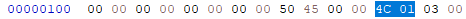

# Introduction

Hello everyone! In this blog, we'll take a closer look at the Phorpiex malware.
Phorpiex is a worm that spreads through USB drives and network drives. Some versions of it can also download and run other types of malware, like cryptominers.

The main reason I decided to analyze this sample is to improve my malware analysis skills and have fun along the way.

# Sample Information
**MD5:** `e2e3268f813a0c5128ff8347cbaa58c8`

**SHA256:** `d8b83f78ed905a7948e2e1e371f0f905bcaaabbb314c692fee408a454f8338a3`

**Size**: `81,920 bytes`

**Scan Date:** `2024-07-17 20:35:23 UTC`

# Static Analysis
The first thing I did was gain an overview of the sample, including the compiler used, any interesting strings, and any apparent use of obfuscation, such as encryption or packers.

After dropping the malware into _Detect It Easy_, it didn’t identify any known packers, and it seemed like the sample was compiled with `Microsoft Visual C/C++ 2008 SP1` using the `Microsoft Linker 9.0` 

In addition to that, we can see that we're dealing with a 32-bit sample. We can further confirm this by looking at the **e_lfanew**, which holds the offset to the start of the NT headers. From there, we can find the machine type and confirm that it’s a 32-bit architecture.

First, we need to locate the DWORD value at offset **0x3C**. This value will point us to the start of the NT headers :

After locating this value, we find the **PE signature** at the indicated offset. If we move forward by 4 bytes, we can locate the machine type, which will confirm the architecture.

and as we can see we found that the machine type is **0x014C** (Little Endian) which is the machine type value for **x86 (32-bit)** architecture.

After we've confirmed all the points mentioned above, let's run Floss, which is very similar to Strings but also has deobfuscation capabilities based on various techniques. You could say it's like String++, anyway, let's run it on the file to see if we can find anything interesting.

After I ran **floss**, I obtained a wealth of information that confirmed the file wasn't packed or encrypted in any way based on the strings.

#### A Few Interesting Findings
- Multiple occurrences of strings related to crypto wallets.
- A number of URLs that could be used as C2 servers or as part of delivering a second stage.
- Registry keys commonly used for persistence by malware and threat actors.
- A number of commands attempting to disable Windows Defender.
- A command that uses `sc.exe` to stop a number of services related to the Windows Update process.
- and more

at this point we got an overview of the file's capabilities and we got ourselves places to focus our attention on.
After I preformed the initial triage I opened-up IDA and started reversing the file.

#### Mutex
The malware attempts to create a mutex. If the mutex already exists, the function exits the process without performing any further actions.

We can see the standard function prologue It saves the current value of the `ebp` register and sets up the stack frame for local variable and allocates `0xFF0` bytes on the stack.

Next, the function calls `Sleep` with a delay of `0x7D0` (2 seconds), which pauses execution for 2 seconds.

After that, the code uses a hard-coded mutex name (`"x66x54x66x"`), which the malware attempts to create.

Following that, a call is made to `GetLastError`, and the result is stored in the `eax` register. The error code is then compared with the value `183`, which corresponds to the error message: **"Cannot create a file when that file already exists."**

In theory, a mutex is an object in Windows that locks a specific resource. Its purpose is to prevent situations where multiple threads are fighting for the same resource, a scenario known as a "race condition." This locking mechanism helps avoid conflicts and potential deadlocks. 
When talking about malware, a mutex can be used to check if the malware is already running. This stops it from starting multiple instances, which could mess with its execution or cause conflicts.

#### Zone Identifier
After the mutex is created, the malware attempts to delete the zone identifier. The zone identifier is a mark of the web artifact that can tell us where the file was downloaded from, which could greatly help in a forensic investigation.

There is a call to `GetModuleFileNameW` with the first parameter set to zero, which means it gets the path of the executable file for the current process. Next, the malware attempts to get the Alternate Data Stream (ADS) of the file, specifically the `Zone.Identifier` stream, and deletes it using `DeleteFileW`.
We could see it more clearly in a debugger.

#### Geolocation Check
Another check that the malware performs is to verify if the locale information is set to UKR, which stands for Ukraine. If that's the case, the malware doesn't perform any further actions and exits execution. This could indicate that this version of Phorpiex originated from Ukraine.

#### Persistence
The malware attempts to place itself in one of three locations:
1. `%windir%`
2. `%userprofile%`
3. `%temp%`

It checks each location one after another, and as soon as it finds a location it can write to, it copies the malware there and sets up persistence in the registry run key. 
If the malware already exists in one of the destination paths, it skips that part and continues its operation.

If the malware was successfully copied to one of the paths mentioned above, it then attempts to add a new record named `Windows Settings` to `Software\Microsoft\Windows\CurrentVersion\Run`, which serves as persistence for the malware.

After setting up persistence, the malware attempts to disable security controls by running the following command:  
`/c powershell -Command "Add-MpPreference -ExclusionPath $env:windir; Add-MpPreference -ExclusionPath $env:TEMP; Add-MpPreference -ExclusionPath $env:USERPROFILE"`  
As we can see, the malware tries to add three locations to Defender's exclusion path. These are the locations where the malware was staged previously.

After that the malware uses `sc.exe` to stop windows update-related services by running the following command :
`/c sc stop UsoSvc & sc stop WaaSMedicSvc & sc stop wuauserv & sc stop DoSvc & sc stop BITS`
This can indicate the malware's attempt to evade defenses by preventing critical updates, leaving the system vulnerable to exploits.

in addition for stopping the services, the malware also disables them completely through the registry :

It changes the value of the `Start` parameter to 4, which means **"(Disabled): The service is disabled and will not be loaded."** We can also see this in the parameters passed in memory:

The malware also performs the same operations on the Defender entries in the registry, disabling every feature it can.

#### Configuration file
the malware creates two `.dat` files that are part of its configuration, those files are `tbtnds.dat` and `tbtcmds.dat`.

It seems that those files are responsible for storing data about commands that were received from the C2 server and information about other known hosts.

#### Crypto Clipper
The malware replaces the real address with one controlled by the attacker, redirecting the funds to the attacker's hard-coded wallet instead of the intended recipient.

The malware contains various hard-coded wallets, which are used to change the clipboard information after several successful checks.

It seems like there are several checks that look at the length of the clipboard data and compare it to static values. It's probably trying to verify if the clipboard length matches any of the standard wallet address lengths.

Next, there's a check to ensure that the clipboard data contains only letters and digits.

Then, it figures out the type of blockchain based on the first character of the clipboard data.

If a valid wallet address is found, the malware uses `SetClipboardData` to replace the existing address with the malware's hard-coded address.

#### Spreading functionality
The malware enumerates the available drives using `GetLogicalDrives`, targeting both removable and remote drives. Additionally, it reads the `Software\Microsoft\Windows\CurrentVersion\Policies\Explorer` registry key, which controls Windows Explorer policies. It reads the `NoDrives` registry value to identify all hidden drives and returns a combination of both available and hidden drives.

After that, the malware copies itself to the `%windir%` folder with hardcoded name - `VolDrvConfig.exe`.
Next, the malware deletes all the files with the following extensions on the drive.

#### Additional payloads 
It looks like the malware acts as a downloader, trying to grab extra payloads from a hardcoded address and filenames. After it pulls the payload, it uses `DeleteUrlCacheEntry` to clear the URL cache entry.

It looks like "1-5" are the hardcoded names for the payloads, and the malware makes a request to `hxxp://185[.]215[.]113[.]66/`. First, it checks if it can make the request using the `Check_URL` function, and then it tries to download the payload using the `download_payload` function. As you can see, it sleeps for 90 seconds between each download.

After that, the file is downloaded to `%temp%`, and its name is a random number generated with `rand()`.

For example :

#### Summary
So that was it. It was my first time writing a report like this and really reversing a full sample from scratch, so there's a good chance I overlooked some things and probably missed a few details.
Feel free to give me feedback on the report, whether it's pointing out errors, offering tips for the future, or anything else.

### Indicators Of Compromise (IOC)
  

<table>
  <colgroup>
    <col style={{ width: '64%' }} />
    <col style={{ width: '12%' }} />
    <col style={{ width: '24%' }} />
  </colgroup>
  <thead>
    <tr>
      <th>Indicators</th>
      <th>Type</th>
      <th>Description</th>
    </tr>
  </thead>
  <tbody>
    {/* File paths & mutex */}
    <tr><td>%windir%\sysarddrvs.exe</td><td>File Path</td><td></td></tr>
    <tr><td>%temp%\sysarddrvs.exe</td><td>File Path</td><td></td></tr>
    <tr><td>%userprofile%\sysarddrvs.exe</td><td>File Path</td><td></td></tr>
    <tr><td>%windir%\VolDrvConfig.exe</td><td>File Path</td><td></td></tr>
    <tr><td>Mutex Name: x66x54x66x</td><td>Mutex</td><td></td></tr>

    {/* Hashes */}
    <tr><td>d8b83f78ed905a7948e2e1e371f0f905bcaaabbb314c692fee408a454f8338a3</td><td>SHA256</td><td></td></tr>

    {/* Domains / URLs / IPs */}
    <tr><td>http[:]//185[.]215[.]113[.]66/</td><td>URL (IP)</td><td></td></tr>
    <tr><td>http[:]//77[.]91[.]77[.]92/</td><td>URL (IP)</td><td></td></tr>
    <tr><td>http[:]//91[.]202[.]233[.]141/</td><td>URL (IP)</td><td></td></tr>
    <tr><td>http[:]//eveezueigohehla[.]co/11[.]exe</td><td>URL</td><td></td></tr>
  </tbody>
</table>

