# Overview
Vidar is an infostealing malware designed to collect a variety of sensitive information from an infected computer and exfiltrate it to an attacker. It operates as malware-as-a-service (MaaS) and has been widely used by cybercriminals since its discovery in late 2018.

Vidar is typically distributed to victims via phishing emails and fake installers. I have personally seen many fake installers containing some type of stealer, such as cracked software, game cheats, keygens, and more.

Here’s an infection flow that I’ve created for what we’re going to analyze today. This is just to give you a general idea of the infection chain and is not 100% accurate:
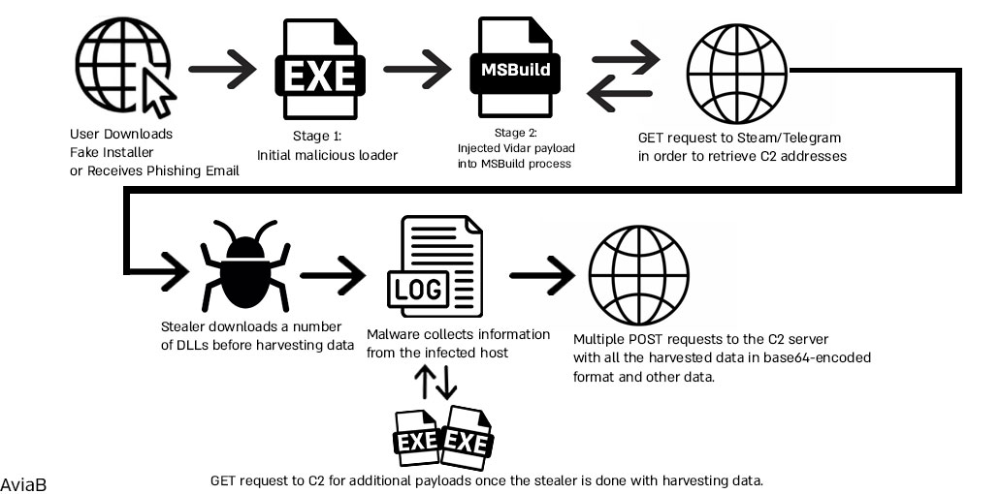


# Sample Information
**MD5:** `b6fff0854975fdd3a69fd2442672de42`

**SHA256:** `fe0d2c8f9e42e9672c51e3f1d478f9398fe88c6f31f83cadbb07d3bb064753c6`

**Size**: `270,336 bytes`

**Compilation date:** `2025-03-13 10:34:19`

# Loader Analysis

### Static Analysis
The first thing I do in every investigation involving files is gain an overview of the files and their capabilities, encryption used, obfuscation, and packers. At this stage, I make hypotheses about the file's capabilities and goals so I can focus on the important aspects and avoid unnecessary rabbit holes.

Dropping the file into Detect it easy,  it didn’t identify any known packers, and it seemed like the sample was compiled with ``Microsoft Visual C/C++(2022+)[-]`` using the ``Microsoft Linker(14.42).``
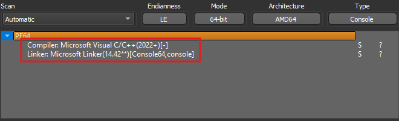

As seen above, the sample appears to be 64-bit. We can verify this by checking the magic header in the optional header of the PE file. A value of 0x20B indicates a 64-bit file, while 0x10B signifies a 32-bit file.

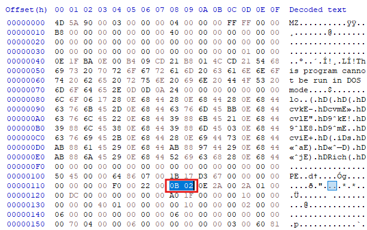

As we can see, this is indeed 0x20B (Little Endian) which means this is 64-bit file.

Next, let's check the compilation time. We can examine the `TimeDateStamp`, which contains a DWORD (4 bytes) value representing the time of compilation.

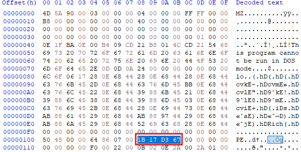

In order to get the actual value, we need to convert it to big endian and then to decimal. The value is stored as epoch time (also known as Unix time), which is how computers store and measure time, so we need to convert it accordingly.

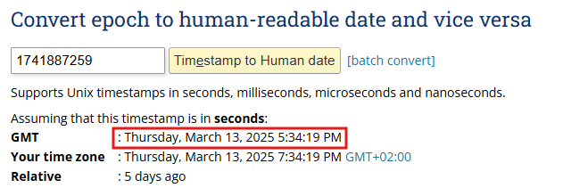

As we can see, after all the conversions, the compilation date is `2025-03-13`. We can verify this by checking any PE parser, i.e., CFF Explorer, PE Bear, and others.

Checking the entropy of the file reveals that the `.BSS` section has high entropy. This section usually contains uninitialized global and static objects, so high entropy could indicate that it contains encrypted shellcode or additional payloads for the malware. It's actually common for attackers to store encrypted shellcode in the `.BSS` and `.data` sections, but we'll revisit this later.

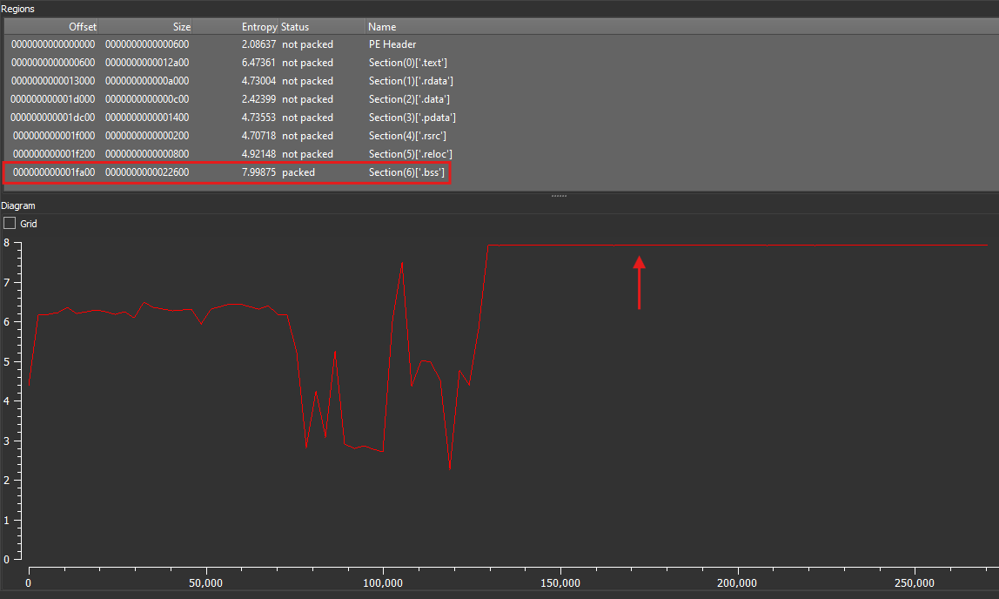

Checking the imports reveals functionality that could be used for anti-analysis and anti-debugging, such as `UnhandledExceptionFilter`, `SetUnhandledExceptionFilter`, `IsDebuggerPresent`, and `GetEnvironmentStringsW`. Additionally, there are functions that suggest potential malicious functionality.

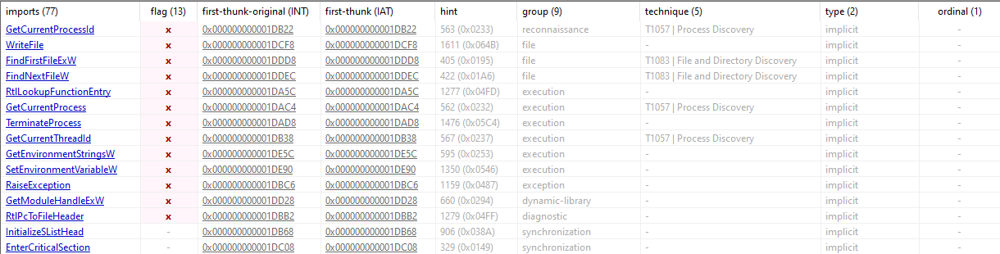
Running Strings/Floss against the file didn't yield any interesting results.


Now that we have an overview of the file, its capabilities, and potential functionality, we can start analyzing it.

First thing that the program does is get it's full path in order to load itself into memory, it's using ``GetModuleHandleW`` and ``GetModuleFileNameA``.

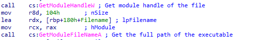

After that, we can see that it opens the file in binary mode. It uses `fopen`, then moves the file pointer to the end with `fseek`, retrieves the file size with `ftell`, and finally closes the file.

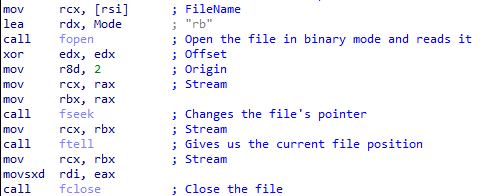

Next, we can see that it allocates memory using the size returned from ftell, then reads the file's contents into the buffer.

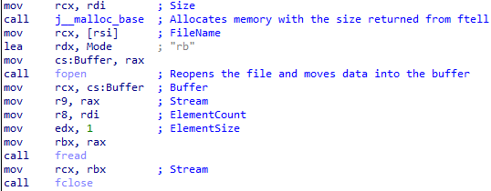

Next, we can see that it loads the file's content into the `R10` register. It then retrieves the `e_lfanew` offset, which contains the address of the PE header. After that, it extracts the number of sections and checks if it is zero, jumping accordingly.

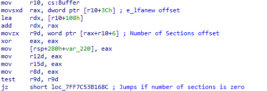

If the number of sections is non-zero, it loads the effective address of a variable named `.BSS`. As we recall, the `.BSS` section had very high entropy, which further supports the idea that it contains some form of encrypted shellcode that will eventually be injected into memory.


### Walking the PEB (Process Environment Block)
"Walking the PEB" is an approach malware authors use to interact with the `Process Environment Block` in Windows. This data structure holds information about the process, loaded modules, environment variables, and more. By walking the PEB, malware authors can dynamically resolve APIs that are typically monitored by security products and may be detected during static analysis.

We can see that the malware accesses the PEB at `gs:60h`, which is how the PEB is accessed in a 64-bit architecture. In a 32-bit architecture, it would be accessed through `fs:30h`.

Next, the malware moves the address of `PEB_LDR_DATA` into `RCX`. `PEB_LDR_DATA` is a structure that holds three pointers to three doubly linked lists of loaded modules. It then accesses offset `0x20`, which corresponds to `InMemoryOrderModuleList` - a structure that contains all the loaded modules in memory, including DLLs.

We can see the string `"KERNEL32.DLL"`. The malware will parse the `InMemoryOrderModuleList`, searching for this module. If found, it returns its address.

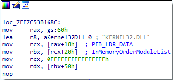

### API Hashing
API hashing is a common trick malware uses to hide its function calls and make static analysis harder. Instead of storing API names like `LoadLibrary` or `GetProcAddress` in plain text, it converts them into hash values. This way, security tools and analysts can’t easily spot which APIs the malware is using just by scanning the binary.

At runtime, the malware calculates hashes for loaded APIs and compares them against its stored values to resolve what it needs. This is often combined with walking the PEB to find loaded modules without relying on standard Windows API calls, making detection even more difficult.

As we can see, it's quite obvious that the malware implements API hashing. Hardcoded hash values are being passed to the `sub_1400011C0` function (`ResolveFunctionByHash`), and the returned address is saved on the stack.
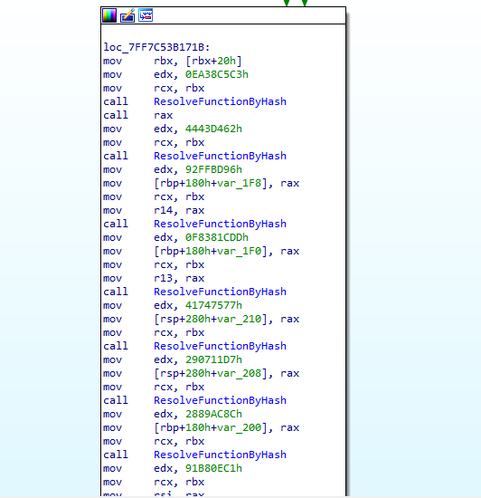

We can create an IDAPython script to retrieve the APIs by recreating the hashing algorithm used by the malware and computing it against a list of exports from the relevant DLL - in this case, `kernel32.dll`. Alternatively, we could debug it and resolve them dynamically.

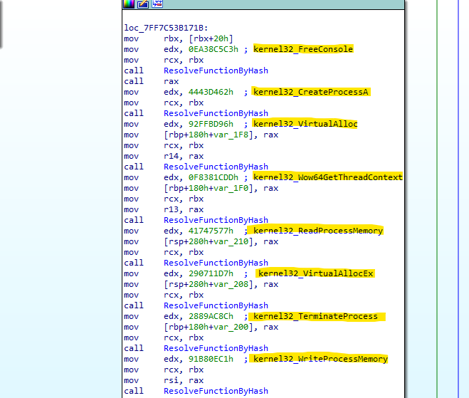

The combination of resolved APIs looks like a classic preparation for process injection. This also makes sense based on what we observed in the `.BSS` section.


### Decryption of Encrypted Shellcode
After that, I see a call to the function `sub_7FF7C53B13F0`, which is responsible for the decryption routine of the encrypted shellcode. The function likely uses RC4 encryption, as indicated by the initialization of an array of 256 bytes, which is part of the `Key Scheduling Algorithm (KSA)` in RC4.

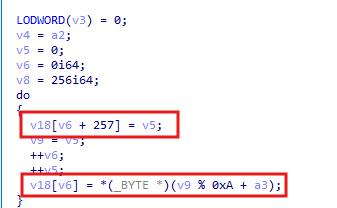

Once the array is initialized, it gets shuffled with a key.

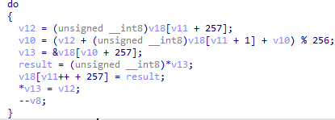

The final step is the `Pseudo-Random Generation Algorithm (PRGA)`, which uses the array to generate a keystream (a pseudo-random byte sequence) that is XORed with the plaintext to produce the ciphertext.

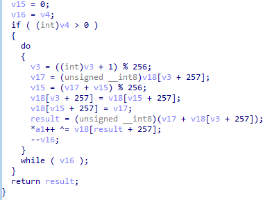

Instead of analyzing it statically, we can just dynamically analyze it, let the magic happen, and get the next stage (;


### Unpacking
Okay, at this point, I have enough information to confidently say that we're dealing with a loader that uses remote process injection to execute its next stage.

There's one neat trick that will help us unpack it with a single breakpoint. As we can see, the malware uses `WriteProcessMemory`. This API takes several parameters, but the third one, `lpBuffer`, is a pointer to the buffer that contains data to be written into the address space of the specified process.

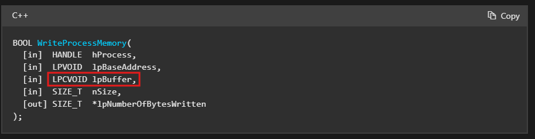

After setting the breakpoint, we can inspect the third argument on the stack, where we should see the data that is about to be written to the process. By doing this, we get the most beautiful thing -the MZ header. It seems like the malware is trying to inject a PE file into a remote process.

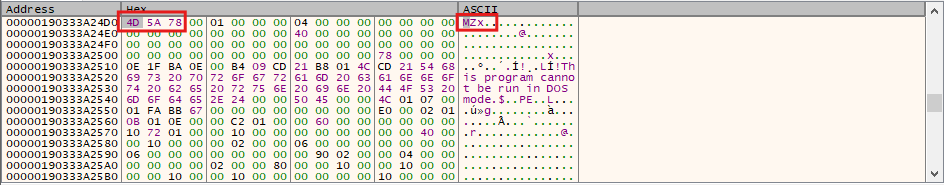

We can follow the memory map and dump the process, but before that, let's see which process it's getting injected into.  
By following the `CreateProcessA` call, which we know the malware uses, we can see that the process being injected with the PE is `C:\Windows\Microsoft.NET\Framework\v4.0.30319\MSBuild.exe`.

Now, let's dump the next stage by following the memory map

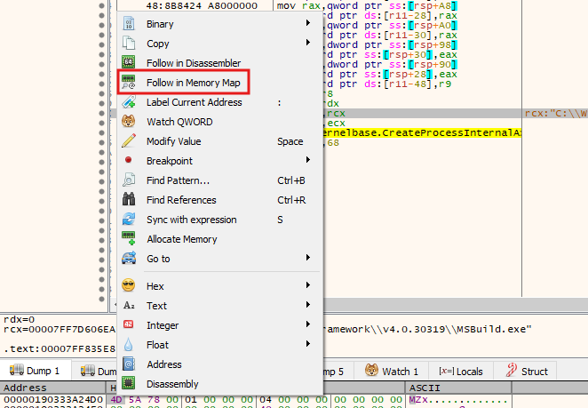

and dumping it to disk

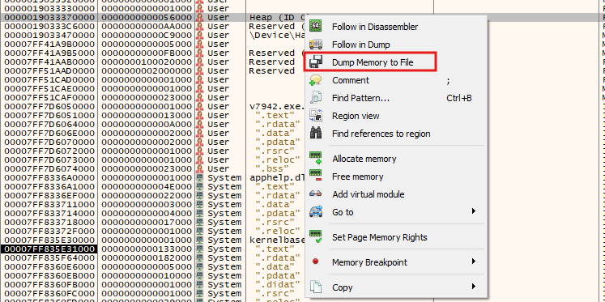

That's about it with the loader. Now, let's analyze the real deal – the stealer!

## Stealer Analysis

### Overview
It seems like this time we're dealing with a 32-bit binary compiled on
`2025-02-23`.  

Running Strings yields quite interesting results:
- Multiple occurrences of strings related to crypto wallets.
- Multiple references to browser paths.
- URLs of a Telegram channel and a Steam profile.
- References to numerous files that could potentially store information about the target and passwords.


### Data Theft
Before the stealer begins data harvesting, it downloads several DLLs from the C2 server, including:
- **freebl3.dll**
- **mozglue.dll**
- **msvcp140.dll**
- **nss3.dll**
- **softokn3.dll**
- **vcruntime140.dll**
  
These DLLs are legitimate and likely used by the stealer to enable parsing of relevant information and to facilitate the necessary capabilities for data harvesting.


Vidar is capable of stealing a wide array of data, including:
- **Browser Data** (history, autofill, cookies)
- **General Information** (username, computer details, local time, language, installed software, processes, and more)
- **Crypto Wallets**
- **Screenshots of your PC**
- **And more**

Let's go over some of the things the stealer harvests.


### FileZilla
The stealer seems to parse the file `\AppData\Roaming\FileZilla\recentservers.xml` and retrieve the hostname, port, and password if they exist.
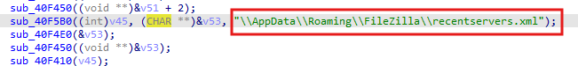

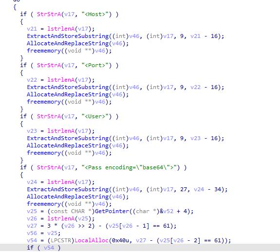

### WinSCP
Next, the stealer opens `Software\\Martin Prikryl\\WinSCP 2\\Configuration`, which is the registry key that contains information about the configuration in `WinSCP`. Then, it enumerates the values to check if `Security` and `UseMasterPassword` exist.

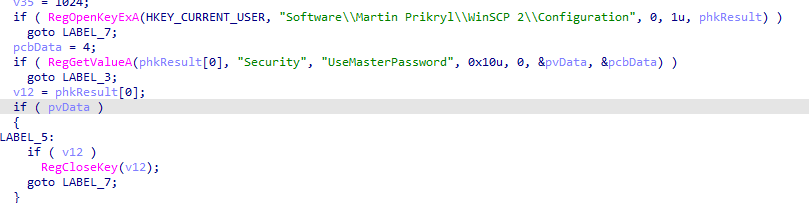

After that, the stealer opens `Software\\Martin Prikryl\\WinSCP 2\\Sessions`, which is the registry key that contains information about saved WinSCP sessions. It then enumerates the session keys and processes each one to extract details such as the `HostName`, `PortNumber`, `UserName`, and `Password`. For each session, the stealer retrieves the values of these registry keys and constructs a string with the session information. If the password exists, it is retrieved and stored as part of the session details. The information is then allocated and copied into memory
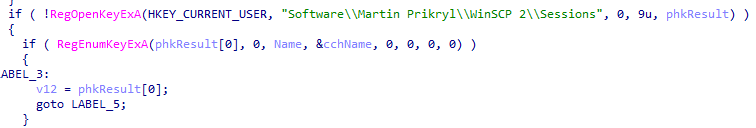

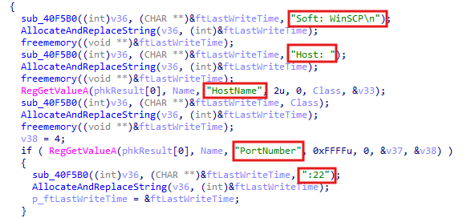

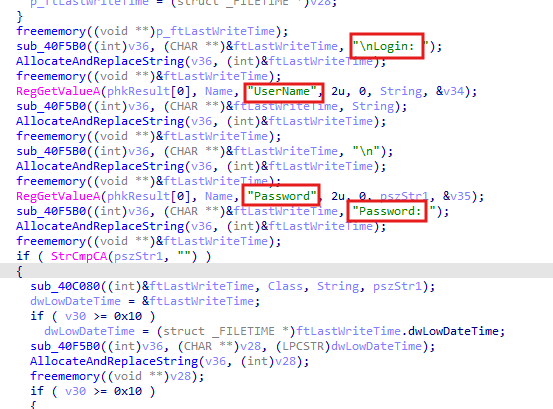

### Screenshot
The stealer captures a screenshot by using `GetDesktopWindow` to get the window handle of the desktop, then it calls `GetDC` to obtain a device context for the desktop window and creates a compatible bitmap with `CreateCompatibleBitmap` to store the screenshot.

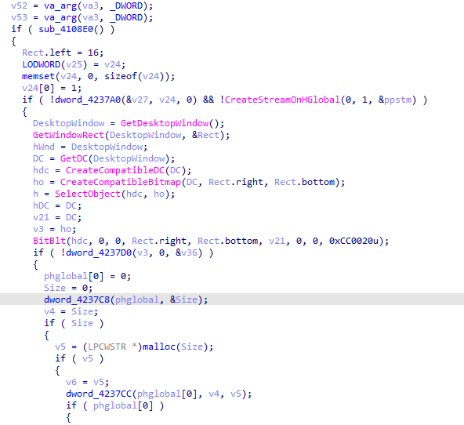

Then it delete any temporary objects, doing sort of a clean-up


### Browser Data
Vidar stealer supports extracting information from the following browsers:
- `Google Chrome`
- `Amigo`
- `Torch`
- `Vivaldi`
- `Comodo Dragon`
- `Epic Privacy Browser`
- `CocCoc`
- `Brave`
- `Cent Browser`
- `7Star`
- `Chedot Browser`
- `Microsoft Edge`
- `360 Browser`
- `QQBrowser`
- `CryptoTab`
- `Opera Stable`
- `Opera GX Stable`
- `Mozilla Firefox`
- `Pale Moon`

It seems like the stealer uses remote browser debugging to steal cookies. Besides that, it goes through all the browser-related files and tries to extract information from them.


### Crypto Wallets
Vidar supports stealing from various cryptocurrency wallets such as Bitcoin, Ethereum, Binance, Brave Wallet, Opera Wallet, Monero, and the list goes on.
For example, the stealer opens the registry key `SOFTWARE\monero-project\monero-core` and queries the value `wallet_path` to check if the file `wallet.keys` exists.
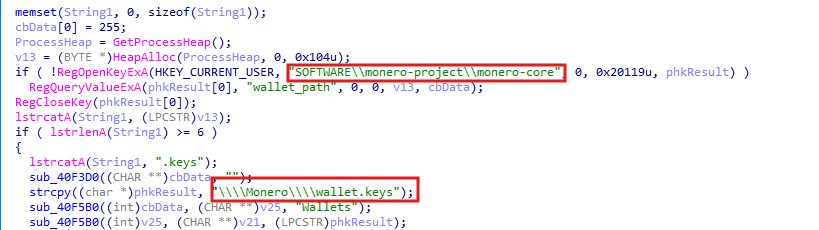


The stealer creates an SQLite database to store information about the collected data, such as passwords, browser history, and other sensitive details.
Here's an example of the basic structure used to store data:
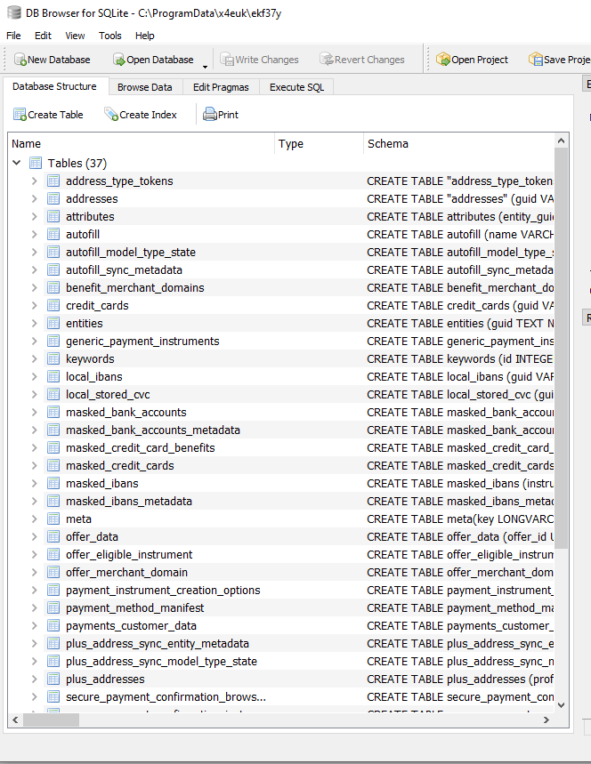

There’s so much more that Vidar stealer is capable of in terms of stealing and harvesting data, but I can’t go over all of them one by one because it would take forever.


### Information Log
The stealer gathers almost all general information about the victim. After collecting the relevant data, it saves it in a file named `information.txt` in memory and sends it to the C2 server.  

**Some of the fields it collects are:**
- Machine ID
- HWID
- GUID
- Computer Name
- Time Zone
- Windows
- And more

In order to extract the relevant information, it uses various APIs and parses registry keys to build the `information.txt` file. For example, to obtain all running processes on the system, the stealer uses the `CreateToolhelp32Snapshot` function to take a snapshot of all running processes. It then iterates over these processes using the `Process32First` and `Process32Next` functions.

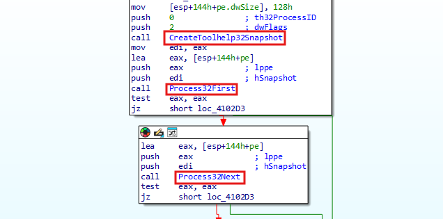

Besides the process enumeration function, the stealer collects information about installed programs from the registry key `HKEY_LOCAL_MACHINE\SOFTWARE\Microsoft\Windows\CurrentVersion\Uninstall`. It then parses the `DisplayName` and `DisplayVersion` values to list all installed software and their respective versions.

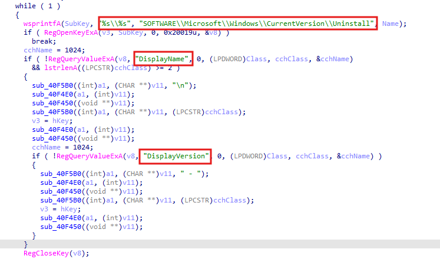

This is how `Information.txt` looks like:
```
Version: 13.2

Date: 20/3/2025 15:44:39
MachineID: 169e761d-7c54-4ade-a217 
GUID: {75ac9683-f7c2}
HWID: 8EBD693388E01671227304-75ac9683-f7c2

Path: C:\Users\AviaLab\Desktop\v7942.exe_000002166AC90000.bin
Work Dir: In memory

Windows: Windows 10 Pro
Install Date: Disabled
AV: Disabled
Computer Name: DESKTOP-C654J0B
User Name: AviaLab
Display Resolution: 1558x920
Keyboard Languages: English (United States) / Hebrew (Israel)
Local Time: 20/3/2025 15:44:39
TimeZone: -8

[Hardware]
Processor: AMD Ryzen 9 7950X3D 16-Core Processor          
Cores: 2
Threads: 2
RAM: 8191 MB
VideoCard: VMware SVGA 3D

[Processes]
System
Registry
smss.exe
csrss.exe
wininit.exe
csrss.exe
winlogon.exe
services.exe
lsass.exe
fontdrvhost.exe
< ... >

[Software]
Digital Detective DCode v5.5 - 5.5.21194.40
Visual Studio Build Tools 2017 - 15.9.61
Event Log Explorer Standard Edition 5.5 - 5.5
Visual Studio Community 2022 - 17.9.6
Kernel OST Viewer ver 21.1
Kernel Outlook PST Viewer ver 20.3
Malcode Analyst Pack v0.24
Microsoft Edge - 134.0.3124.72
Microsoft Edge WebView2 Runtime - 134.0.3124.72
Nmap 7.93 - 7.93
Npcap - 1.73
PDFStreamDumper 0.9.5xx
vbdec
WinSCP 6.1.1 - 6.1.1
< ... >


```
In addition, there’s another file called `passwords.txt`, which appears to contain all the collected passwords. This file is sent to the C2 during the data exfiltration process.

### Additional Payloads
The stealer also acts as a downloader. Once it finishes all its harvesting activities, it downloads additional payloads to `C:\ProgramData\<GeneratedFolder>\` using `InternetOpenA`.

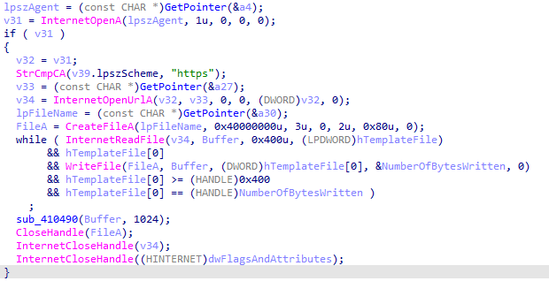

We can verify this by using a debugger. Let's set a breakpoint on `InternetOpenUrl` and check the second argument passed on the stack. It should be `lpszUrl`, a pointer to a null-terminated string variable that specifies the URL to begin reading.
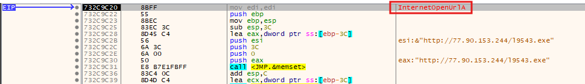

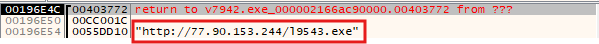

After that, it uses `WriteFileA` to write the file to `C:\ProgramData\<GeneratedFolder>\` with a newly generated name and executes it using `ShellExecuteExW`.

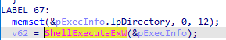

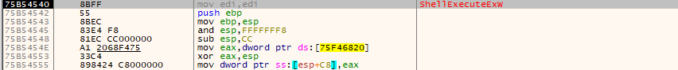

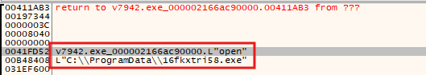

### Self-Deletion
Once the malware completes all its activities, it performs self-deletion using `ShellExecuteA`. It does this by opening `cmd.exe` and running the following command:  
`"C:\Windows\system32\cmd.exe" /c del /f /q "<MalwarePath>" & timeout /t 11 & rd /s /q "C:\ProgramData\<GeneratedFolder>" & exit`

First, the malware forcefully and silently deletes its own executable with `del /f /q "<MalwarePath>"`. It then waits for 11 seconds (`timeout /t 11`) before recursively and silently removing the dynamically generated directory `<GeneratedFolder>`.

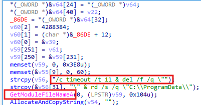

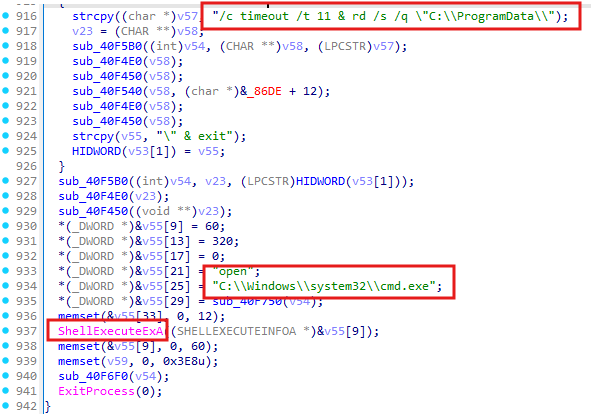

### C2 Communication
After looking into it a bit, I've discovered that the stealer uses a known technique called **"Dead Drop Resolver"**, which leverages existing, legitimate external web services to host information that points to additional command and control (C2) infrastructure. By doing this, malware authors can avoid hardcoding C2 addresses in their malware, making detection and takedown efforts more challenging.

I observed that the stealer uses two well-known sites — **Steam** and **Telegram**. For those unfamiliar, **Steam** is a popular gaming platform where users can purchase thousands of games, while **Telegram** is a widely used messaging platform.
Following those URLs reveals the real C2 address in use by the stealer
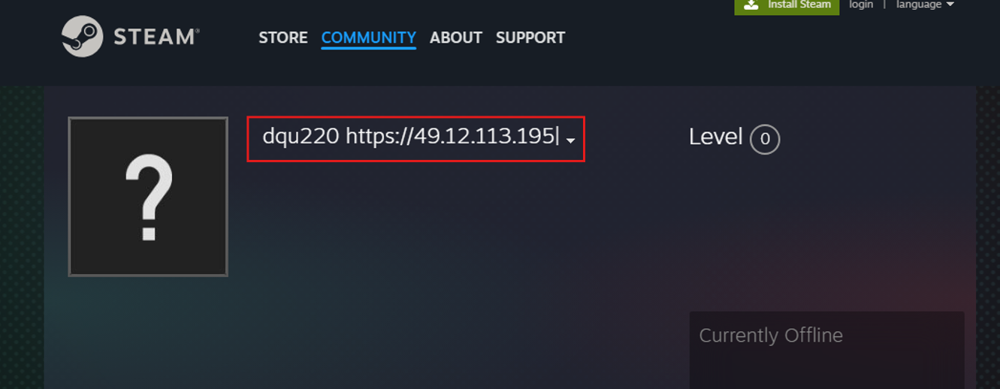

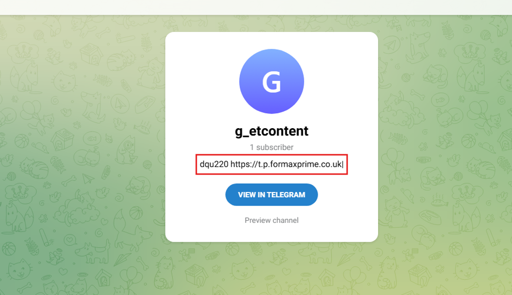

The addresses are bundled with a hard-coded profile ID (dqu220), which is used to retrieve the correct configuration of the malware.


### C2 Data Exfiltration
From what it seems, the stealer creates a zip archive where it stores all the relevant files and sends it in a POST request to the C2 server in a base64-encoded format. In the last POST request, the stealer adds additional content to be sent to the C2 server.
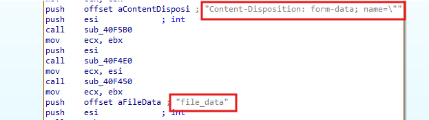

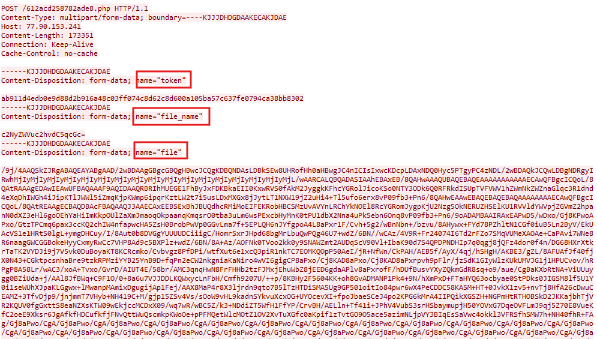

### Summary
Vidar Stealer is a highly versatile malware designed to steal a wide variety of sensitive information. It uses smart techniques to avoid hard-coded command-and-control (C2) servers, making it harder to track. On top of that, it can act as a downloader, fetching and executing additional malicious payloads.


## Indicators Of Compromise (IOC)

<div class="ioc-table">

<div class="ioc-table">

<table>
  <colgroup>
    <col style={{ width: '64%' }} />
    <col style={{ width: '12%' }} />
    <col style={{ width: '24%' }} />
  </colgroup>
  <thead>
    <tr>
      <th>Indicators</th>
      <th>Type</th>
      <th>Description</th>
    </tr>
  </thead>
  <tbody>
    {/* Hashes */}
    <tr><td>fe0d2c8f9e42e9672c51e3f1d478f9398fe88c6f31f83cadbb07d3bb064753c6</td><td>SHA256</td><td></td></tr>
    <tr><td>f2399716df6735c66dfa05a713ff41182e80a6c3c596ecb133b34b65f2d1f00f </td><td>SHA256</td><td></td></tr>
    <tr><td>dcc05c3ac7ae22d601bcb7c97cfcda568f3041bd39b2fd8899282dfde83369a5</td><td>SHA256</td><td></td></tr>
    <tr><td>879d835c2156b4d12a5e4d542c282861540c3799225238ff34ffa4b308c376cb</td><td>SHA256</td><td></td></tr>
    <tr><td>d2bcc0239e7a272fa47b91a726598fd7ad526d7ca16a3ca3556bfc3db7e3bb81</td><td>SHA256</td><td></td></tr>

    {/* Domains / URLs / IPs */}
    <tr><td>hxxp[://]77[.]90[.]153[.]241/a07daa7aeaf96e14/vcruntime140[.]dll</td><td>URL</td><td></td></tr>
   <tr><td>hxxp[://]77[.]90[.]153[.]241/a07daa7aeaf96e14/softokn3[.]dll</td><td>URL</td><td></td></tr>
   <tr><td>hxxp[://]77[.]90[.]153[.]241/a07daa7aeaf96e14/nss3[.]dll</td><td>URL</td><td></td></tr>
   <tr><td>hxxp[://]77[.]90[.]153[.]241/a07daa7aeaf96e14/msvcp140[.]dll</td><td>URL</td><td></td></tr>
   <tr><td>hxxp[://]77[.]90[.]153[.]241/a07daa7aeaf96e14/mozglue[.]dll</td><td>URL</td><td></td></tr>
   <tr><td>hxxp[://]77[.]90[.]153[.]241/a07daa7aeaf96e14/freebl3[.]dll</td><td>URL</td><td></td></tr>
   <tr><td>hxxp[://]77[.]90[.]153[.]244/v7942[.]exe</td><td>URL</td><td></td></tr>
   <tr><td>hxxps[://]steamcommunity[.]com/profiles/76561199832267488</td><td>URL</td><td></td></tr>
   <tr><td>hxxps[://]t[.]me/g_etcontent</td><td>URL</td><td></td></tr>
   <tr><td>hxxps[://]t[.]p[.]formaxprime[.]co[.]uk</td><td>URL</td><td></td></tr>
  </tbody>
</table>

</div>


</div>

### Yara Rules
```css
rule Vidar_stealer {
    meta:
        description = "A rule for detecting Vidar stealer malware"
        sha1 = "689f5c3624a4428e9937ca6a6c26d449dc291a12"
        author = "AviaB"

	
    strings:
		$mz = "MZ"
        $B1 = "steamcommunity.com/profiles/76561199832267488"
		$B2 = "t.me/g_etcontent"
		$B3 = "information.txt"
		$B4 = "passwords.txt"
		$B5 = "HWID:"
		$B6 = "MachineID:"
		$B7 = "GUID:"
		$B8 = "AV:"

    condition:
        ($mz at 0) and 2 of ($B*)

}
```
